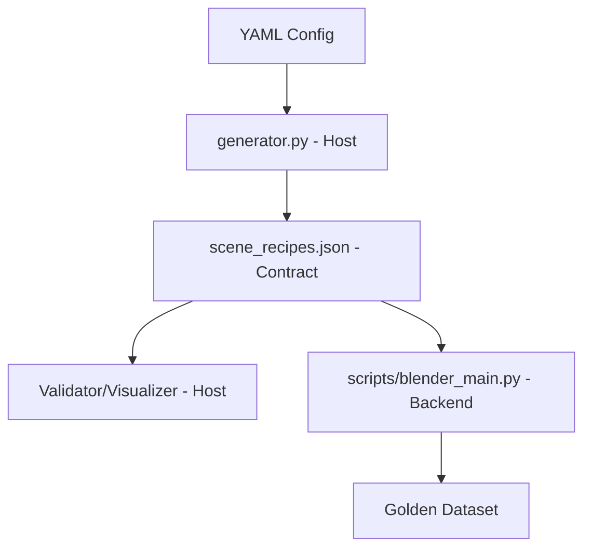

# Architectural Guidelines

## Host vs Backend Separation
This project relies on a strict separation between the "Host" (Python environment) and the "Backend" (Blender environment).

### Host Code
- **Location**: `src/render_tag/` (excluding `scripts/` and `backend/` logic that runs in Blender).
- **Environment**: Standard Python (managed by `uv`).
- **Forbidden Imports**: `bpy`, `blenderproc`, `mathutils`.
- **Responsibilities**:
    - Configuration parsing (`config.py`).
    - Procedural generation logic (`generator.py`).
    - Recipe validation (`schema.py`).
    - Process orchestration.

### Backend Code
- **Location**: `src/render_tag/scripts/` and internal Blender scripts.
- **Environment**: Blender's bundled Python.
- **Allowed Imports**: `bpy`, `blenderproc`, `mathutils`.
- **Responsibilities**:
    - Loading `SceneRecipe` JSON.
    - Executing 3D operations.
    - Rendering images.

## Data Flow

## Specific Logic Rules
- **Corner Ordering**: When extracting tag corners, always project 3D vertices and verify CLOCKWISE order (Top-Left -> Top-Right -> Bottom-Right -> Bottom-Left).