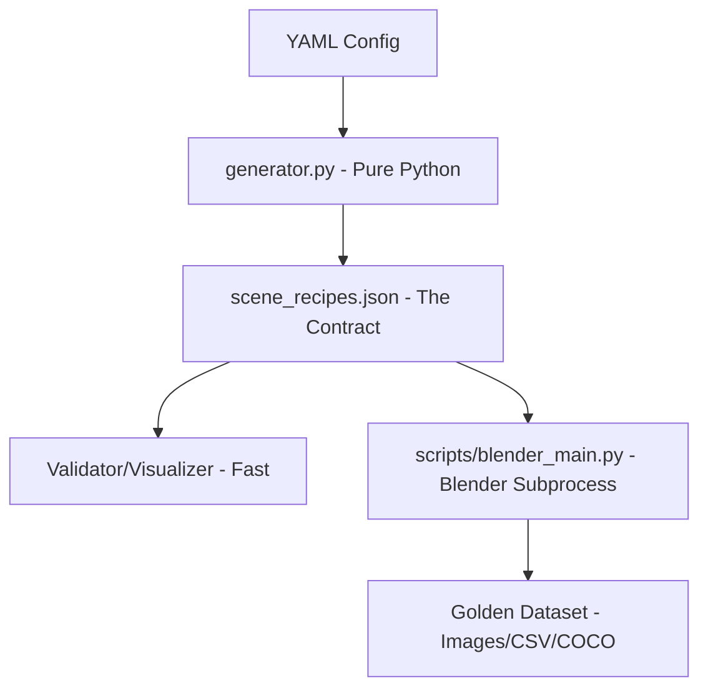

# AGENTS.md - The Law and The Loop

Welcome, Agent. This project follows **Google Antigravity Best Practices**. Your goal is to generate high-fidelity synthetic data without breaking the render pipeline.

---

## 1. The Law
These are absolute constraints. Violation leads to failure.

1.  **Strict Isolation**: `src/render_tag/generator.py` (Logic) must NEVER import `bpy` (Blender).
2.  **The Subprocess Pattern**: Blender runs in its own process. You interact with it ONLY via `SceneRecipe` JSON files.
3.  **Schema is King**: If it doesn't validate against `src/render_tag/schema.py`, it doesn't exist.
4.  **UV Only**: All commands must use `uv run`.

> [!IMPORTANT]
> Always read [.agent/rules](file:///.agent/rules) and use [.agent/workflows/](file:///.agent/workflows/) for common tasks.

---

## 2. The Loop (How to Iterate Fast)
Do not wait for 3D renders. Use the **Shadow Render** loop.

1.  **Draft Logic**: Edit `src/render_tag/generator.py`.
2.  **Generate & Validate**:
    ```bash
    uv run render-tag generate --config configs/dev.yaml --output output/test --scenes 1
    uv run render-tag validate-recipe --recipe output/test/scene_recipes.json
    ```
3.  **Visual Feedback**:
    ```bash
    uv run render-tag viz-recipe --recipe output/test/scene_recipes.json --output output/test/viz
    ```
4.  **Optimize**: Refine the math in `generator.py` based on the 2D PNG outputs.

---

## 3. Architecture Overview



## 4. Workflows
Use these slash commands for standard operations:
- `/lint_code`: Lint and format using `ruff`.
- `/type_check`: Type check using `ty`.
- `/generate_data`: Full generation and validation sequence.

---

## 5. Directory Map
- [schema.py](file:///src/render_tag/schema.py): The source of truth for recipes.
- [generator.py](file:///src/render_tag/generator.py): Where the procedural math happens.
- [blender_main.py](file:///src/render_tag/scripts/blender_main.py): The 3D render driver.
- [.agent/](file:///.agent/): Agent-specific rules and workflows.
