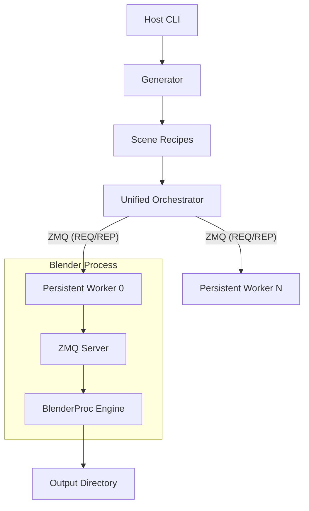

# System Architecture (v3.0)

`render-tag` is designed as a **Host-Backend** system using ZMQ to bridge the gap between a standard Python environment and Blender's embedded environment.

## High-Level Flow

## Core Components

1.  **Host Process (Standard Python)**:
    *   **Orchestration (`orchestration/orchestrator.py`)**: Manages the lifecycle of persistent worker processes. It communicates with workers over ZMQ, monitors health, and handles automatic restarts on failure or VRAM exhaustion.
    *   **Generator (`generator.py`)**: Pure logic component. It defines "Recipes" (`SceneRecipe`) for each scene deterministically. 
    *   **CLI (`cli/main.py`)**: Unified entry point that binds orchestration and generation.

2.  **Backend Process (Blender)**:
    *   **ZMQ Server (`backend/zmq_server.py`)**: A minimal bootstrap script that runs inside Blender. It starts a ZMQ listener and waits for commands.
    *   **Worker Server (`backend/worker_server.py`)**: The "Hot Loop" implementation. It receives recipes, stabilizes the Blender environment via `bridge.py`, and calls the rendering engine.
    *   **Engine (`backend/engine.py`)**: Low-level interaction with `BlenderProc` to actually render the 3D scene and save metadata.

## The "Hot Loop" Contract

The communication between Host and Backend happens over ZMQ using a robust REQ/REP pattern:

- **INIT**: Orchestrator tells the worker to prime its environment (BlenderProc initialization).
- **RENDER**: Orchestrator sends a `SceneRecipe`. The worker renders it and remains alive.
- **STATUS**: Periodic heartbeat and telemetry (VRAM, uptime).
- **SHUTDOWN**: Graceful termination.

This separation allows for high throughput (no Blender startup overhead) and excellent testability (mocking the ZMQ backend).

## Geometric Data Contract (3D-Anchored Orientation)

To ensure synthetic data maintains 6DoF orientation integrity (roll/pitch/yaw), `render-tag` follows a strict local-space geometric contract for all point-based subjects (Tags, Boards).

### The "Logical Corner 0" Rule
All subject keypoint arrays MUST be ordered such that:
1.  **Index 0**: Represents the **Logical Top-Left** of the subject's local payload/texture.
2.  **Indices 1, 2, 3**: Follow a strict **Clockwise** winding in the subject's local XY plane (Z-up).
    - Index 1: Logical Top-Right
    - Index 2: Logical Bottom-Right
    - Index 3: Logical Bottom-Left

### Architectural Enforcement
-   **Asset Layer**: `keypoints_3d` are assigned explicitly in local coordinates during mesh generation.
-   **Projection Layer**: Performs a pure mathematical transformation (World -> Camera -> Pixel) without any visual re-sorting heuristics.
-   **Annotation Layer**: Preserves the original 3D indices in the 2D output (COCO keypoints, CSV corners).
