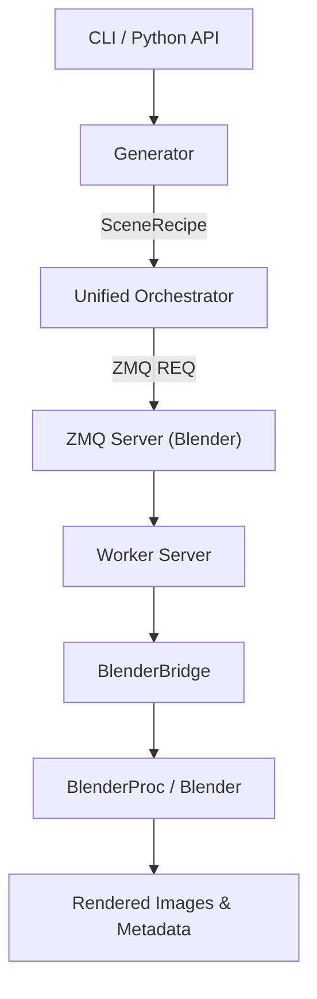

# Architecture

`render-tag` follows a strictly decoupled architecture to ensure that generation logic is independent of the rendering engine.

## High-Level Overview

The system is divided into **Host** code (Python >=3.11) and **Backend** code (Blender/BlenderProc).

## Components

### 1. Core (`src/render_tag/core/`)
The foundation of the system. Contains the single source of truth **Schemas** (Pydantic models), configuration logic, and fundamental utilities.

### 2. Generation (`src/render_tag/generation/`)
Pure Python procedural logic. Samples parameters and builds `SceneRecipe` objects. It has **no** dependency on Blender.

### 3. Backend (`src/render_tag/backend/`)
The 3D rendering engine.

- **`bootstrap.py`**: Centralized environment stabilization. Handles paths, venv site-packages, and logging.
- **`bridge.py`**: `BlenderBridge` provides explicit Dependency Injection for Blender/BlenderProc APIs.
- **`worker_server.py`**: Implementation of the "Hot Loop" ZMQ server.
- **`engine.py`**: The actual BlenderProc execution logic.

### 4. Orchestration (`src/render_tag/orchestration/`)
The `UnifiedWorkerOrchestrator` manages the lifecycle of `PersistentWorkerProcess` instances. It handles ZMQ communication, VRAM guardrails, and parallel sharding.

### 5. Data I/O (`src/render_tag/data_io/`)
Handles asset loading, caching, and writing final annotations (COCO, CSV).

## The "Hot Loop" (Persistent Workers)

To avoid the significant overhead of starting Blender for every scene, `render-tag` uses a persistent worker architecture.

1.  **Orchestrator** starts one or more Blender instances in the background.
2.  Each Blender instance runs a **ZMQ Server** (`zmq_server.py`).
3.  The Orchestrator sends **Scene Recipes** over ZMQ.
4.  The **Worker Server** receives the recipe, uses the **BlenderBridge** to access APIs, and renders the scene.
5.  Blender remains ready for the next recipe without quitting.

This "Hot Loop" can improve rendering throughput by $2-5\times$ for small scenes.

## Rendering Performance (CV-Safe)

To maximize generation speed while maintaining the high sub-pixel accuracy required for fiducial tag detection, `render-tag` employs several optimization strategies:

### 1. Adaptive Sampling & Denoising
We use Cycles' **Adaptive Sampling** with a noise threshold (default $0.05$) rather than a fixed sample count. This is combined with **Intel OpenImageDenoise (OIDN)** guided by Albedo and Normal passes. This "CV-Safe" approach ensures that flat surfaces render nearly instantaneously while high-frequency edges (like tag corners) receive enough samples to remain sharp and accurate.

### 2. Light Path Optimization

Standard path tracing bounces light many times to achieve artistic realism. For computer vision training, we "min-max" these bounces to balance fidelity with throughput:

| Parameter | Value | Rationale |
| :--- | :---: | :--- |
| **Total Bounces** | 4 | Diminishing returns for CV after 4. |
| **Diffuse** | 2 | Enough for realistic indirect lighting. |
| **Glossy** | 4 | Critical for preserving specular highlights (glare). |
| **Transmission** | 0 | Disabled unless glass/refraction is explicitly needed. |
| **Caustics** | Off | Computationally expensive and irrelevant for tag detection. |

## Geometric Data Contract (3D-Anchored Orientation)

To ensure synthetic data maintains 6DoF orientation integrity ($\text{roll}, \text{pitch}, \text{yaw}$), `render-tag` follows a strict local-space geometric contract for all point-based subjects (Tags, Boards).

### The "Logical Corner 0" Rule

All subject keypoint arrays MUST be ordered such that:

1.  **Index 0**: Represents the **Logical Top-Left** of the subject's local payload/texture, located at local coordinates $(-w/2, -h/2, 0)$.
2.  **Indices 1, 2, 3**: Follow a strict **Clockwise (CW)** winding in the subject's local $XY$ plane.
    -   Index 1: Logical Top-Right $(+w/2, -h/2, 0)$
    -   Index 2: Logical Bottom-Right $(+w/2, +h/2, 0)$
    -   Index 3: Logical Bottom-Left $(-w/2, +h/2, 0)$

### Architectural Enforcement

-   **Asset Layer**: `keypoints_3d` are assigned explicitly in local coordinates during mesh generation.
-   **Projection Layer**: Performs a pure mathematical transformation from world space $P_{world}$ to pixel space $p_{pixel}$:
    $$
    p_{pixel} = K [R|t] P_{world}
    $$
    This ensures zero-drift between the 3D asset and its 2D annotations without any visual re-sorting heuristics.
-   **Annotation Layer**: Preserves the original 3D indices in the 2D output (COCO keypoints, CSV corners).

## Reproducibility

Correctness in synthetic data requires strict reproducibility. `render-tag` ensures this through:

- **Environment Fingerprinting:** We hash the `uv.lock` and record the Blender version. If the environment changes, the system issues a warning or error.
- **Config Hashing:** Every dataset contains a `job.json` (JobSpec) that includes a SHA256 hash of the exact configuration used.
- **Asset Hashing:** The `JobSpec` includes a SHA256 hash of all external assets (HDRIs, floor textures, tag images) referenced by the job. This prevents "silent" dataset drift when binary assets are updated on disk or on the Hub.
- **Deterministic Sharding:** Seeds are derived from a master seed and shard index, ensuring that scene #500 is identical regardless of whether it was rendered in a single batch or as part of a specific shard.
