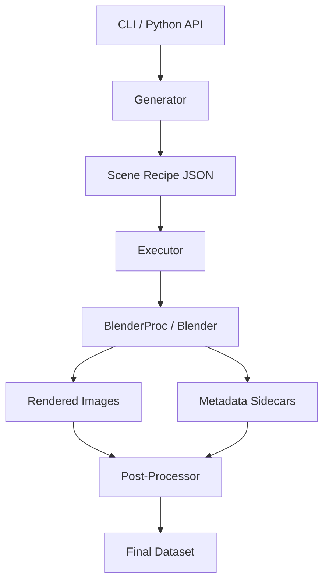

# Architecture

`render-tag` follows a strictly decoupled architecture to ensure that generation logic is independent of the rendering engine.

## High-Level Overview

The system is divided into **Host** code (Python 3.12) and **Backend** code (Blender/BlenderProc).

## Components

### 1. Schema (`src/render_tag/schema/`)
The single source of truth. Defined using Pydantic models. Every scene is described by a `SceneRecipe`, which is a hermetic description of world, objects, and cameras.

### 2. Generator (`src/render_tag/generation/`)
Pure Python logic that samples parameters (camera poses, lighting, tag IDs) and builds `SceneRecipe` objects. It has **no** dependency on Blender.

### 3. Backend (`src/render_tag/backend/`)
The rendering driver. It consumes a `SceneRecipe` and uses `BlenderProc` to build the 3D scene and execute the render. This component runs inside the Blender Python environment.

### 4. Orchestration (`src/render_tag/orchestration/`)
Handles the lifecycle of rendering jobs, including parallelization (sharding) and execution environments (Local vs. Docker).

## The "Hot Loop" (Persistent Workers)

To avoid the significant overhead of starting Blender for every scene, `render-tag` uses a persistent worker architecture.

1.  **Orchestrator** starts one or more Blender instances in the background.
2.  Each Blender instance runs a **ZMQ Server** (`zmq_server.py`).
3.  The Orchestrator sends **Scene Recipes** over ZMQ.
4.  Blender renders the scene, saves the result, and remains ready for the next recipe without quitting.

This "Hot Loop" can improve rendering throughput by **2-5x** for small scenes.

## Reproducibility

Correctness in synthetic data requires strict reproducibility. `render-tag` ensures this through:

- **Environment Fingerprinting:** We hash the `uv.lock` and record the Blender version. If the environment changes, the system issues a warning or error.
- **Config Hashing:** Every dataset contains a `job.json` (JobSpec) that includes a SHA256 hash of the exact configuration used.
- **Deterministic Sharding:** Seeds are derived from a master seed and shard index, ensuring that scene #500 is identical regardless of whether it was rendered in a single batch or as part of a specific shard.
